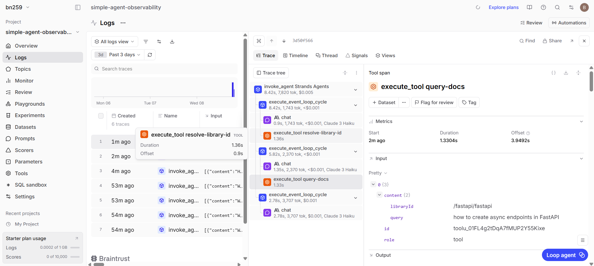

# MCP Observability Analysis

*Screenshot showing MCP tool invocation in Braintrust trace*

I connected to the Context7 MCP server and loaded its documentation search tools. At startup, `list_tools_sync()` returned 2 tools: `resolve-library-id` and `query-docs`. These were combined with the existing DuckDuckGo tool and passed to the agent.

In the Braintrust traces, I observed that a single query produced a multi-step span tree. The agent first called `execute_tool resolve-library-id` to map the library name to Context7's internal ID (`/fastapi/fastapi`), then called `execute_tool query-docs` with that ID and the original question as the topic to fetch the actual documentation. 

DuckDuckGo invocations return raw web snippets rather than structured documentation content like Context7.